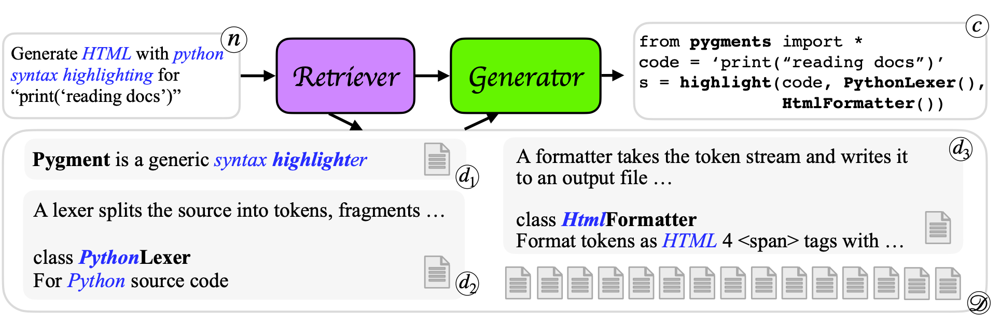

# DocPrompting: Generating Code by Retrieving the Docs
[[paper]](https://arxiv.org/pdf/2207.05987.pdf) [[openreview]](https://openreview.net/forum?id=ZTCxT2t2Ru)

Publicly available source-code libraries are continuously growing and changing. 
This makes it impossible for models of code to keep current with all available APIs by simply training these models 
on existing code repositories. 
we introduce DocPrompting: a natural-language-to-code generation approach that explicitly leverages documentation by (1) retrieving the relevant documentation pieces given an NL intent, 
and (2) generating code based on the NL intent and the retrieved documentation. 

In the current version, we provide the *best* model on each setting.



## Table of content
* [Preparation](#preparation)
* [Retrieval](#retrieval)
  + [Dense retrieval](#dense-retrieval)
  + [Sparse retrieval](#sparse-retrieval)
* [Generation](#generation)
  + [FID generation](#fid-generation)
* [Data](#data)
* [Resources](#resources)
* [Citation](#citation)


## Preparation
Download data for `CoNaLa` and `tldr` from [link](https://drive.google.com/file/d/1CzNlo8-e4XqrgAME5zHEWEKIQMPga0xl/view?usp=sharing)
```bash
# unzip
unzip docprompting_data.zip
# move to the data folder
mv docprompting_data/* data
```

Download trained generator weights from [link](https://drive.google.com/file/d/1NmPMxY1EOWkjM7S8VSKa13DKJmEZ3TqV/view?usp=sharing)
```bash
unzip docprompting_generator_models.zip
# move to the model folder
mv docprompting_generator_models/* models/generator

```
## Retrieval
### Dense retrieval 
(`CoNaLa` as an example)

The code is based on [SimCSE](https://github.com/princeton-nlp/SimCSE)

1. Run inference with our trained model on CoNaLa (Python)
```bash
python retriever/simcse/run_inference.py \
  --model_name "neulab/docprompting-codet5-python-doc-retriever" \
  --source_file data/conala/conala_nl.txt \
  --target_file data/conala/python_manual_firstpara.tok.txt \
  --source_embed_save_file data/conala/.tmp/src_embedding \
  --target_embed_save_file data/conala/.tmp/tgt_embedding \
  --sim_func cls_distance.cosine \
  --num_layers 12 \
  --save_file data/conala/retrieval_results.json
```
We observed that model whether or not to normalize the embeddings can affect the retrieval results. 
We therefore selected this hyper-parameter (`--normalize_embed`) on the validation set.

The results will be saved to `data/conala/retrieval_results.json`.

2. Train your own retriever
```bash
python retriever/simcse/run_train.py \
    --num_layers 12 \
    --model_name_or_path Salesforce/codet5-base \
    --sim_func cls_distance.cosine \
    --temp 0.05  \
    --train_file data/conala/train_retriever_sup_unsup.json \
    --eval_file data/conala/dev_retriever.json \
    --output_dir models/retriever/docprompting_codet5_python_doc_retriever \
    --eval_src_file data/conala/conala_nl.txt \
    --eval_tgt_file data/conala/python_manual_firstpara.tok.txt \
    --eval_root_folder data/conala \
    --eval_oracle_file data/conala/cmd_dev.oracle_man.full.json \
    --run_name docprompting_codet5_python_doc_retriever \
    --num_train_epochs 10 \
    --per_device_train_batch_size 512 \
    --learning_rate 1e-5 \
    --max_seq_length 32 \
    --evaluation_strategy steps \
    --metric_for_best_model recall@10 \
    --load_best_model_at_end \
    --eval_steps 125 \
    --overwrite_output_dir \
    --do_train \
    --eval_form retrieval
    "$@"
```
* `train_retriever_sup_unsup.json` contains the supervised (`CoNaLa` training and mined) and unsupervised data (duplication of sentences in a doc) for training the retriever.
* Be accurate on the saved model name. If using codet5, make sure `codet5` is in the name.

### Sparse retrieval 
(`tldr` as an example)

*There are two stages in the retr*ieval procedure in `tldr`.
The first stage retrieves the bash command and the second stage retrieves the potentially relevant paragraphs that describe the usage of the arguments
1. build index with Elasticsearch
```bash
python retriever/bm25/main.py \
  --retrieval_stage 0
```
2. first stage retrieval
```bash
python retriever/bm25/main.py \
  --retrieval_stage 1 \
  --split {cmd_train, cmd_dev, cmd_test}
```
3. second stage retrieval
```bash
python retriever/bm25/main.py \
  --retrieval_stage 2 \
  --split {cmd_train, cmd_dev, cmd_test}
```

---
## Generation
### FID generation
The code is based on [FiD](https://github.com/facebookresearch/FiD)
A training or evaluation file should be converted to the format compatible with FiD. 
An example is [here](./data/conala/example_fid_data.json)
> **Warning**: FiD has a strong dependency on the version of `transformers` (3.0.2).
> Unable to match the version might result in inreproducible results.
1. Run generation. Here is an example with our [trained model] on Python CoNaLa(./models/generator/)
```bash
ds='conala'
python generator/fid/test_reader_simple.py \
    --model_path models/generator/${ds}.fid.codet5.top10/checkpoint/best_dev \
    --tokenizer_name models/generator/codet5-base \
    --eval_data data/${ds}/fid.cmd_test.codet5.t10.json \
    --per_gpu_batch_size 8 \
    --n_context 10 \
    --name ${ds}.fid.codet5.top10 \
    --checkpoint_dir models/generator  \
    --result_tag test_same \
    --main_port 81692
```
The results will be saved to `models/generator/{name}/test_results_test_same.json`

2. Train your own generator
```bash
ds='conala'
python generator/fid/train_reader.py \
    --seed 1996 \
    --train_data data/${ds}/fid.cmd_train.codet5.t10.json \
    --eval_data data/${ds}/fid.cmd_dev.codet5.t10.json \
    --model_name models/generator/codet5-base \ # initialize with the codet5-base model \
    --per_gpu_batch_size 4 \
    --n_context 10 \
    --name ${ds}.fid.codet5.top10 \
    --checkpoint_dir models/generator/ \
    --eval_freq 500 \
    --accumulation_steps 2 \
    --main_port 30843 \
    --total_steps 20000 \
    --warmup_steps 2000
    
ds='tldr'
python generator/fid/train_reader.py \
    --dataset tldr \
    --train_data data/${ds}/fid.cmd_train.codet5.t10.json \
    --eval_data data/${ds}/fid.cmd_model_select.codet5.t10.json \
    --model_name models/generator/codet5-base \
    --per_gpu_batch_size 4 \
    --n_context 10 \
    --eval_metric token_f1 \
    --name ${ds}.fid.codet5.top10 \
    --checkpoint_dir models/generator/ \
    --eval_freq 1000 \
    --accumulation_steps 2 \
    --main_port 32420 \
    --total_steps 20000 \
    --warmup_steps 2000
```
* Examples in `fid.cmd_model_select.codet5.t10.json` are the same as `fid.cmd_dev.codet5.t10.json`.
The difference is that it use the oracle first stage retrieval results (oracle bash name).
---
## Data
The `data` folder contains the two benchmarks we curated or re-splitted.
* tldr
* CoNaLa

On each dataset, we provide 
1. Natural language intent (entry `nl`)
2. Oracle code (entry `cmd`) 
  * Bash for tldr
  * Python for CoNaLa
3. Oracle docs (entry `oracle_man`) 
  * In the data files, we only provide the manual ids, their contents could be found in the `{dataset}/{dataset}_docs.json`.
4. Other data with different format for different modules

## Resources 
* [tldr](https://github.com/tldr-pages/tldr) Github repo. Thanks for all the contributors!
* [CoNaLa](https://conala-corpus.github.io)

## Citation
```
@article{zhou22docprompting,
    title = {# DocPrompting: Generating Code by Retrieving the Docs},
    author = {Shuyan Zhou and Uri Alon and Frank F. Xu and Zhiruo Wang and Zhengbao Jiang and Graham Neubig},
    year = {2022}
}
```
